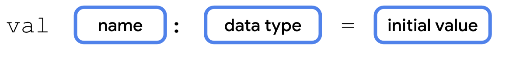

# Variables and Data Types

## Variable

In computer programming, there's the concept of a variable, which is a container for a single piece of data.

## Data Types

| Kotlin data type | What kind of data it can contain                                                                                            | Example literal values                 |
| ---------------- | --------------------------------------------------------------------------------------------------------------------------- | -------------------------------------- |
| String           | Text                                                                                                                        | "Add contact"<br>"Search"<br>"Sign in" |
| Int              | Integer number                                                                                                              | 32<br>1293490<br>-59281                |
| Double           | Decimal number                                                                                                              | 2.0<br>501.0292<br>-31723.99999        |
| Float            | Decimal number (that is less precise than a Double). Has an f or F at the end of the number.                                | 5.0f<br>-1630.209f<br>1.2940278F       |
| Boolean          | true or false. Use this data type when there are only two possible values. Note that true and false are keywords in Kotlin. | true<br>false                          |

## Define and use variables

```kotlin
// Variable declaration
val count: Int = 2

println("You have $count unread messages.") // String template
```



If you don't provide an initial value when you declare a variable, you must specify the type.

```kotlin
// No Initial value
val count: Int

// With Initial value, no need to specify the type
val count = 2
```

Example:

```kotlin
fun main() {
    val unreadCount = 5
    val readCount = 100
    println("You have ${unreadCount + readCount} total messages in your inbox.")
}
```

## `var` and `val` keywords

- `val` keyword - Use when you expect the variable value will not change.

- `var` keyword - Use when you expect the variable value can change.

- you should only use `var` to declare a variable if you expect the value to change. Otherwise you should default to using `val` to declare a variable.

## Double

```kotlin
fun main() {
    val trip1: Double = 3.20
    val trip2: Double = 4.10
    val trip3: Double = 1.72
    val totalTripLength: Double = trip1 + trip2 + trip3
    println("$totalTripLength miles left to destination")
}
```

- remove the unnecessary Double data type from the variable declarations because of type inference.

```kotlin
fun main() {
    val trip1 = 3.20
    val trip2 = 4.10
    val trip3 = 1.72
    val totalTripLength = trip1 + trip2 + trip3
    println("$totalTripLength miles left to destination")
}
```

## String

```kotlin
fun main() {
    val nextMeeting = "Next meeting: "
    val date = "January 1"
    val reminder = nextMeeting + date + " at work"
    println(reminder)
}
```

```kotlin
fun main() {
    println("Say \"hello\"")
}
```

## Boolean

```kotlin
fun main() {
    val notificationsEnabled: Boolean = false
    println("Are notifications enabled? " + notificationsEnabled)
}
```

## Commenting

```kotlin
/*
 * This program displays the number of messages
 * in the user's inbox.
 */
fun main() {
    // Create a variable for the number of unread messages.
    var count = 10
    println("You have $count unread messages.")

    // Decrease the number of messages by 1.
    count--
    println("You have $count unread messages.")
}
```
