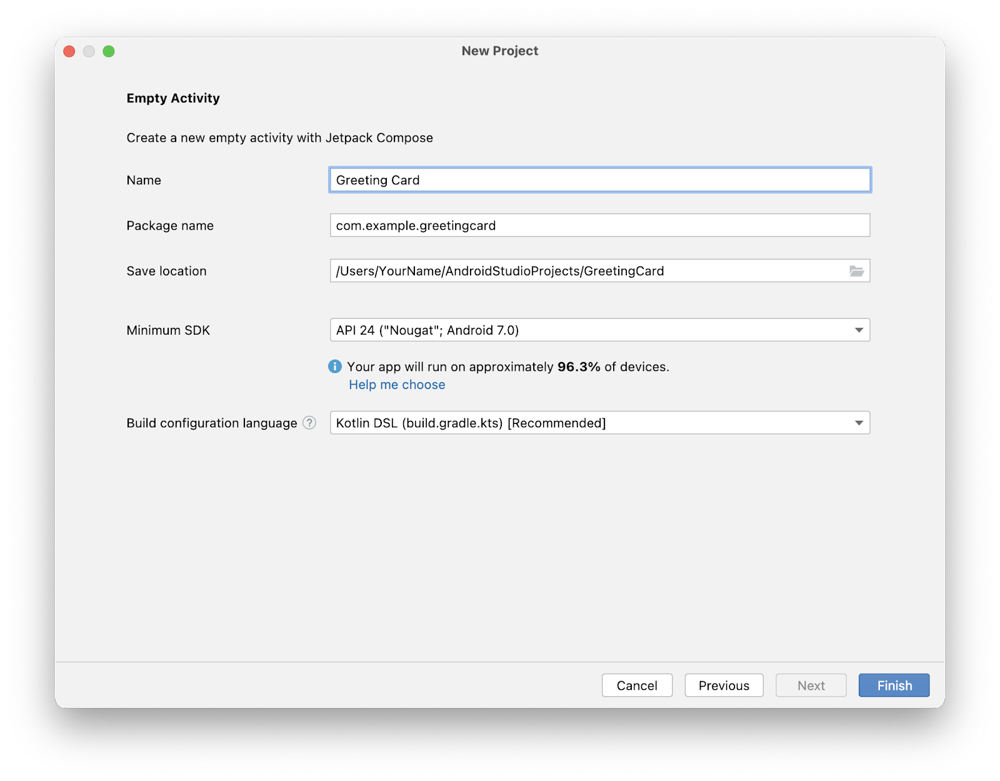

# New Android Project

**Phone and Tablet** -> **Empty Activity**



## Default code

```kotlin
package com.example.greetingcard

import android.os.Bundle
import androidx.activity.ComponentActivity
import androidx.activity.compose.setContent
import androidx.activity.enableEdgeToEdge
import androidx.compose.foundation.layout.fillMaxSize
import androidx.compose.foundation.layout.padding
import androidx.compose.material3.Scaffold
import androidx.compose.material3.Text
import androidx.compose.runtime.Composable
import androidx.compose.ui.Modifier
import androidx.compose.ui.tooling.preview.Preview
import com.example.greetingcard.ui.theme.GreetingCardTheme

class MainActivity : ComponentActivity() {
    override fun onCreate(savedInstanceState: Bundle?) {
        super.onCreate(savedInstanceState)
        enableEdgeToEdge()
        setContent {
            GreetingCardTheme {
                Scaffold(modifier = Modifier.fillMaxSize()) { innerPadding ->
                    Greeting(
                        name = "Android",
                        modifier = Modifier.padding(innerPadding)
                    )
                }
            }
        }
    }
}

@Composable
fun Greeting(name: String, modifier: Modifier = Modifier) {
    Text(
        text = "Hello $name!",
        modifier = modifier
    )
}

@Preview(showBackground = true)
@Composable
fun GreetingPreview() {
    GreetingCardTheme {
        Greeting("Android")
    }
}
```

- The `onCreate()` function is the entry point to this Android app and calls other functions to build the user interface.

- The `setContent()` function within the `onCreate()` function is used to define your layout through composable functions.

- All functions marked with the `@Composable` annotation can be called from the `setContent()` function or from other Composable functions. The annotation tells the Kotlin compiler that this function is used by Jetpack Compose to generate the UI.

## Composable function

```kotlin
@Composable
fun Greeting(name: String, modifier: Modifier = Modifier) {
    Text(
        text = "Hello $name!",
        modifier = modifier
    )
}
```

- You add the `@Composable` annotation before the function.
- `@Composable` function names are capitalized.
- `@Composable` functions can't return anything.

## Preview

```kotlin
@Preview(showBackground = true)
@Composable
fun GreetingPreview() {
    GreetingCardTheme {
        Greeting("Android")
    }
}
```

- To enable a preview of a composable, annotate with `@Composable` and `@Preview`. The `@Preview` annotation tells Android Studio that this composable should be shown in the design view of this file.
